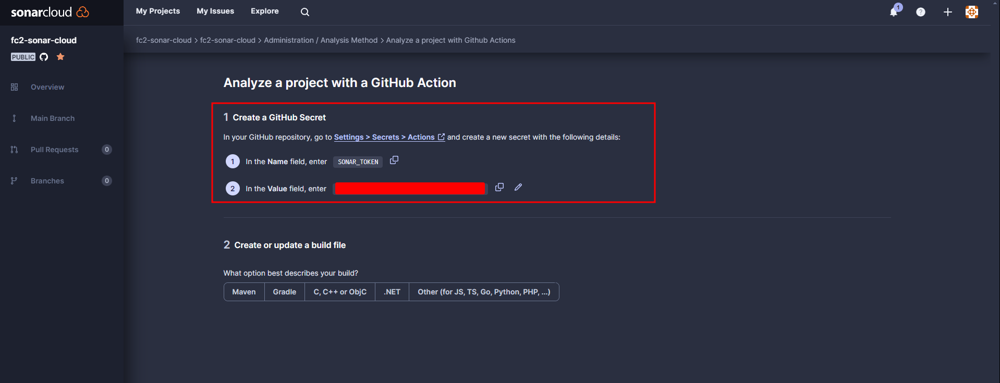
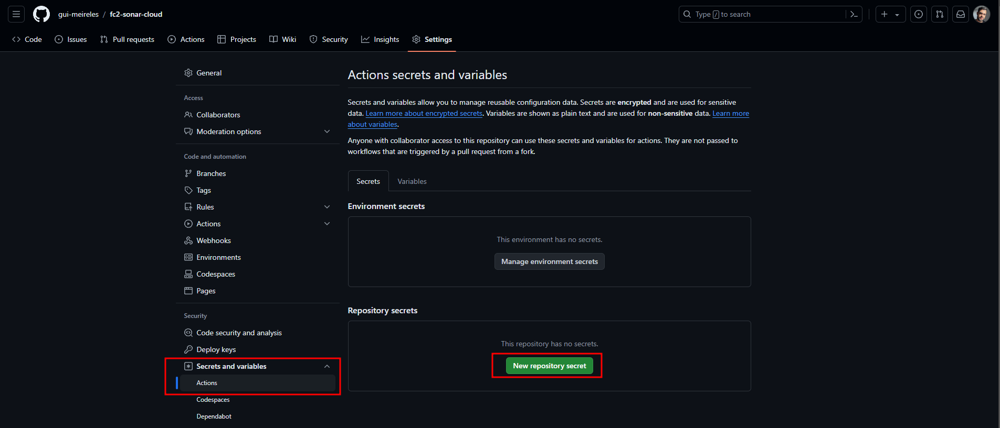
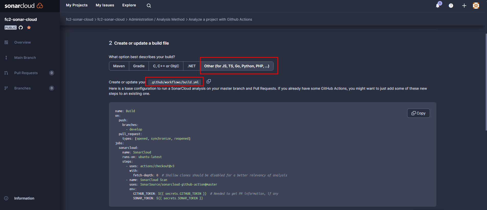
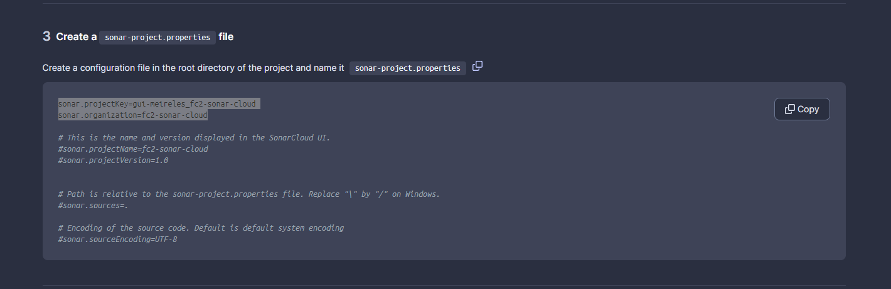
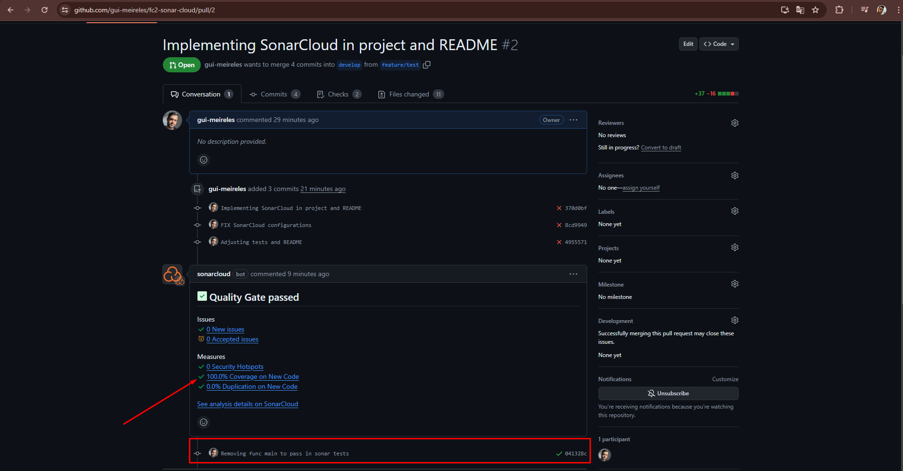
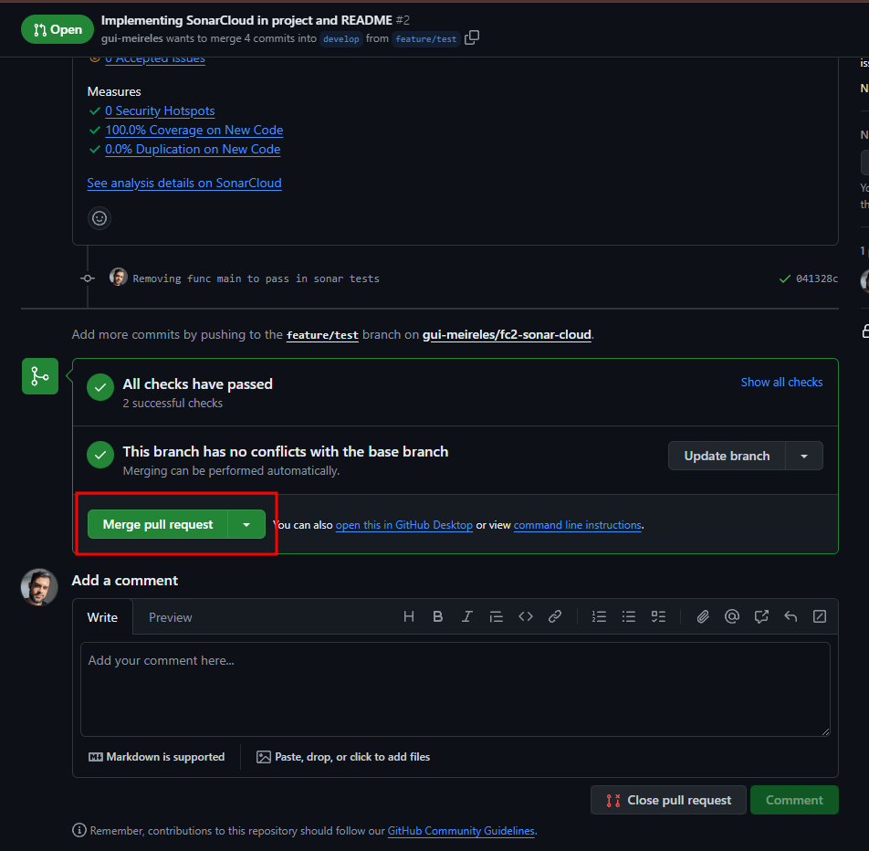

### Conceitos do SonarQube

- Rules: Temos regras que aplicaremos no nosso projeto, como validações, segurança, etc....

- Quality Profiles: Criamos um perfil para a linguagem do nosso projeto e atribuimos as rules pra esse perfil

- Quality Gates: Ele quem bloqueia caso a aplicação tenha alguma falha de segurança, taxa baixa de testes, linhas duplicadas, etc...

---

### Primeiros passos

- O funcionamento do **SonarCloud** pegará apenas pull requests feitos na `develop`

- Adicione o seu repositório no SonarCloud: https://sonarcloud.io/projects

- Após, clique em continuar com **GitHub Actions** e adicione o token no seu repository

- Continuando, selecione a linguagem da sua aplicação e adicione o que o sonar pedir:

- Após feita essas configurações no seu **projeto** e no **SonarCloud**, podemos assim criar uma branch
a partir da `develop` e sempre que for feito um pull request para a `develop`, você verá o job
do **SonarCloud** rodando:

> No gif abaixo, podemos ver que meu pull request **passou** no teste do run-ci, mas do SonarCloud **não passou**,
pois a cobertura de testes não foi o suficiente para atingir o mínimo que era `> 80%`:

- Removendo a func **_main_** da minha aplicação, meus testes passaram com 100% de cobertura:
- Permitindo assim, eu fazer o merge com a develop:

